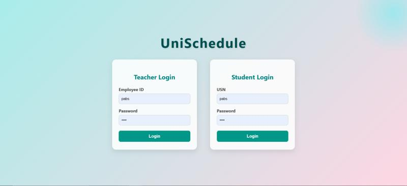
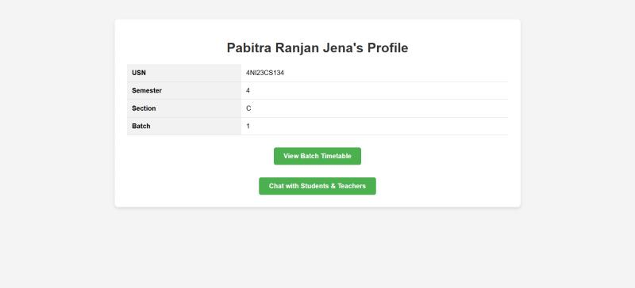
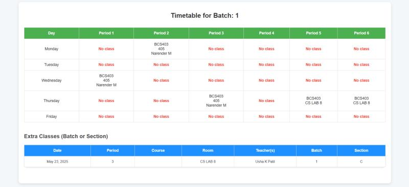
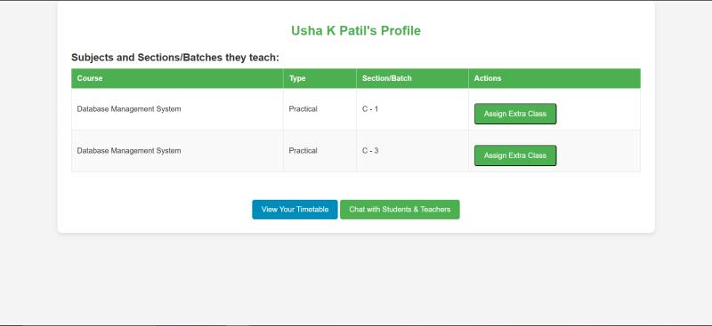
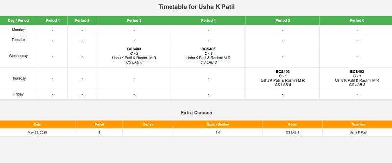
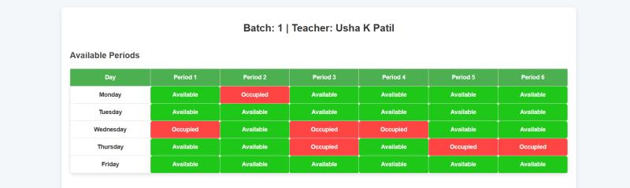
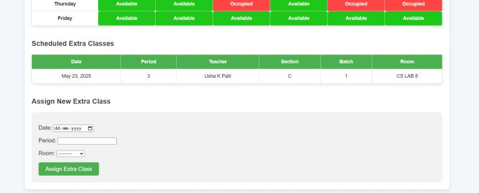
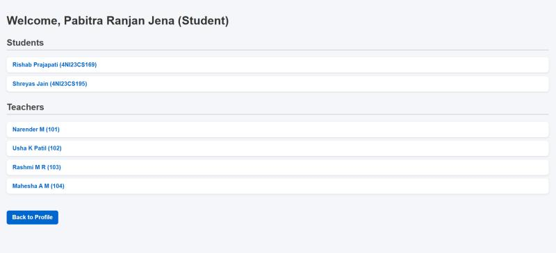
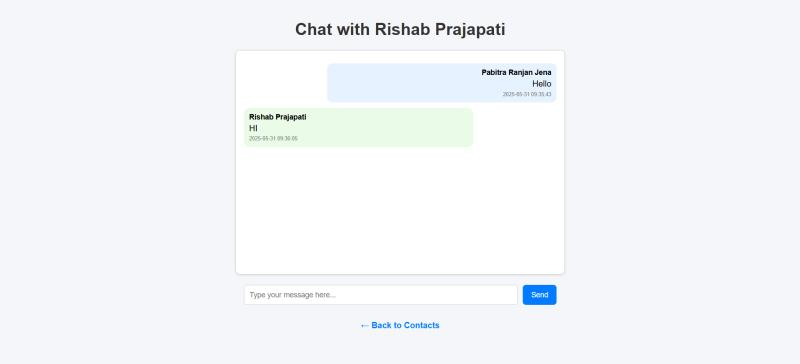

# 📅 UniSchedule – University Academic Companion

UniSchedule is a Django-based web application designed to help universities and colleges manage academic timetables, assign extra classes, and enable real-time student-teacher communication.

## 🚀 Features

- 📆 Weekly Timetable View (Batch-wise and Teacher-wise)
- 🧠 Smart Extra Class Scheduling (checks conflicts and room availability)
- 💬 Real-Time Chat System (Student–Teacher and Teacher–Teacher)
- 🔐 Role-based Login for Students and Teachers
- 🗃️ Easy Data Management for Sections, Courses, Teachers, Rooms

---

## 🎥 Screenshots

### Login Page

### Student Profile View

### Student Timetable View

### Teacher Profile View

### Teacher Timetable View

### Available Slots

### Assign Extra Class

### Chat Home

### Chat Interface

---

## 🛠️ Tech Stack

- **Backend:** Django
- **Frontend:** HTML, CSS, Bootstrap
- **Database:** SQLite (PostgreSQL/MySQL compatible)

---
